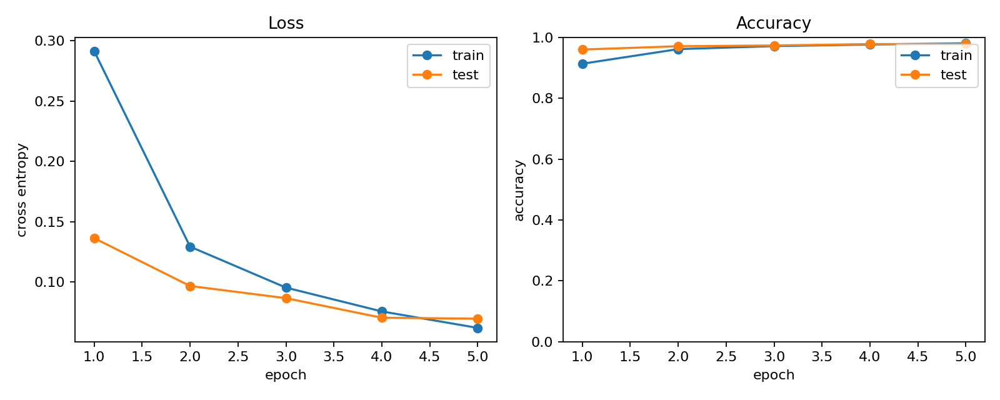
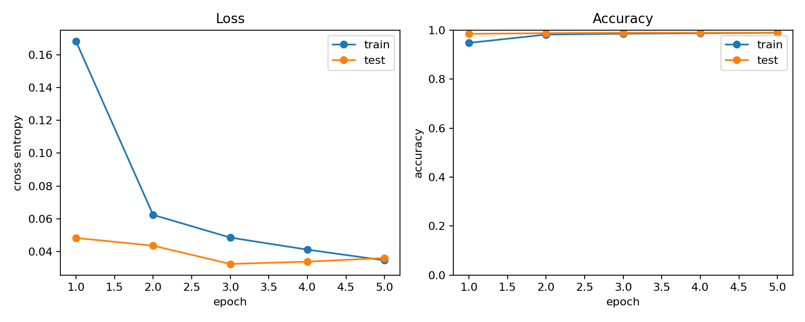
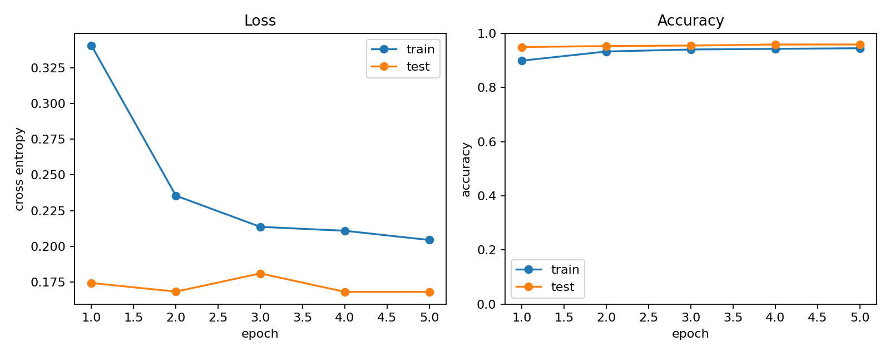

# Project 1：MNIST MLP 与 CNN 对照实验

> 实验状态：已于 2026-07-31 在 `ai-learn` 环境完成正式 MNIST 训练、最佳
> checkpoint 独立评估、曲线绘制和一组单变量对照。以下数字均来自本机实际运行，
> 不是预期值或 synthetic 冒烟结果。

这个项目把 Tensor、`nn.Module`、`DataLoader`、训练/评估模式、device、checkpoint、
CSV 日志和曲线绘制组成一个完整 PyTorch 闭环，并用 MLP/CNN 对照观察图像空间归纳
偏置（spatial inductive bias）的作用。

完整逐行教程见
`1_每日任务指南/W2_工程实践02_MNIST完整教程.md`。

## 1. 实验结论

| 实验 | 唯一改动 | 参数量 | 最佳 checkpoint | 独立评估 test loss | 独立评估 test accuracy |
|---|---|---:|---:|---:|---:|
| MLP baseline | 无 | 203,530 | epoch 4 | 0.0705 | **97.79%** |
| CNN baseline | 模型改为 CNN | 421,834 | epoch 3 | 0.0324 | **98.91%** |
| MLP learning-rate control | 学习率 `0.001 → 0.01` | 203,530 | epoch 4 | 0.1681 | **95.84%** |

在当前 5-epoch、单 seed 设置下，CNN 比 MLP 的最佳测试准确率高 **1.12 个百分点**，
最佳 checkpoint 的测试交叉熵也更低。学习率对照中，其他条件不变时把 Adam 学习率
提高十倍，MLP 最佳准确率下降 **1.95 个百分点**。

## 2. 实际环境与参数

### 运行环境

| 项目 | 实际值 |
|---|---|
| 操作系统 | Windows build 10.0.26200 |
| Conda 环境 | `ai-learn` |
| Python | 3.11.15 |
| PyTorch / torchvision | 2.11.0+cu130 / 0.26.0+cu130 |
| NumPy / Matplotlib | 2.4.4 / 3.10.8 |
| GPU | NVIDIA GeForce RTX 5060 Laptop GPU，CUDA |
| cuDNN | 9.19.0 |

### 共同实验参数

| 参数 | 实际值 |
|---|---|
| 数据集 | torchvision MNIST，train 60,000 / test 10,000 |
| 输入 | 单通道 `1×28×28` |
| 预处理 | `ToTensor()` 后按 mean `0.1307`、std `0.3081` 归一化 |
| Epochs | 5 |
| Train batch size | 128 |
| 训练中 test batch size | 128 |
| 独立评估 batch size | 256 |
| Optimizer | Adam，默认 `betas=(0.9, 0.999)`、`eps=1e-8`、无 weight decay |
| Baseline learning rate | 0.001 |
| Loss | `CrossEntropyLoss` |
| Seed | 42 |
| DataLoader workers | 0 |
| Device 参数 | `auto`，实际解析为 `cuda` |

MLP 是 `784 → 256 → 10`，含 ReLU 和 dropout 0.2。CNN 使用两组
`Conv-BatchNorm-ReLU-MaxPool`，再接 `3136 → 128 → 10` 分类头和 dropout 0.3。

本次数据已存在于 `data/MNIST/raw/`，torchvision 成功读取完整 60k/10k 数据，因此没有
发生新的下载或下载错误。`data/`、`runs/` 和 `*.pt` 由 `.gitignore` 排除；README 中
展示的 PNG 另存到 `project1_mnist/assets/`，便于保留实验曲线。

## 3. 本次实际执行的命令

以下命令都在仓库根目录
`2_成果作品/A-thousand-journey-s-beginning` 执行。

### 环境与冒烟测试

```powershell
conda run -n ai-learn python -m unittest discover -s project1_mnist/tests -v
```

结果为 3/3 tests passed。

### 正式训练

```powershell
conda run -n ai-learn python -m project1_mnist.train `
  --dataset mnist --model mlp --epochs 5 --overwrite

conda run -n ai-learn python -m project1_mnist.train `
  --dataset mnist --model cnn --epochs 5 --overwrite
```

这里使用 `--overwrite`，是因为默认目录中已有旧的 synthetic/先前运行产物；正式结果已
覆盖到 `runs/mnist/{mlp,cnn}/`。本机整条命令墙钟时间（包括 Conda 启动、数据读取、
每轮评估和保存）分别约为 MLP 66.3 秒、CNN 126.0 秒。墙钟受当时系统负载影响，不用于
比较模型计算效率。

### 独立加载最佳 checkpoint 评估

```powershell
conda run -n ai-learn python -m project1_mnist.evaluate `
  runs/mnist/mlp/best.pt

conda run -n ai-learn python -m project1_mnist.evaluate `
  runs/mnist/cnn/best.pt
```

实际输出：

```text
model=mlp epoch=4 test_loss=0.0705 test_accuracy=97.79%
model=cnn epoch=3 test_loss=0.0324 test_accuracy=98.91%
```

这一步没有沿用训练进程中的内存模型，而是由独立入口重新构造模型、加载 `best.pt` 并
遍历测试集，验证 checkpoint 确实可恢复。

### 绘图

```powershell
conda run -n ai-learn python -m project1_mnist.plot_history `
  runs/mnist/mlp/history.csv `
  --output project1_mnist/assets/mnist_mlp_curves.png

conda run -n ai-learn python -m project1_mnist.plot_history `
  runs/mnist/cnn/history.csv `
  --output project1_mnist/assets/mnist_cnn_curves.png
```

## 4. Baseline 逐 epoch 指标与曲线

### MLP

| Epoch | Train loss | Train accuracy | Test loss | Test accuracy |
|---:|---:|---:|---:|---:|
| 1 | 0.2914 | 91.33% | 0.1365 | 95.99% |
| 2 | 0.1294 | 96.13% | 0.0968 | 97.08% |
| 3 | 0.0955 | 97.11% | 0.0867 | 97.33% |
| 4 | 0.0757 | 97.63% | 0.0705 | **97.79%** |
| 5 | 0.0621 | 98.04% | 0.0697 | **97.79%** |

`best.pt` 在 epoch 4 首次达到 97.79% 时保存；epoch 5 准确率持平，而代码只在准确率
严格提高时替换最佳 checkpoint，所以独立评估加载的是 epoch 4。



### CNN

| Epoch | Train loss | Train accuracy | Test loss | Test accuracy |
|---:|---:|---:|---:|---:|
| 1 | 0.1683 | 94.76% | 0.0483 | 98.46% |
| 2 | 0.0623 | 98.15% | 0.0435 | 98.72% |
| 3 | 0.0485 | 98.53% | 0.0324 | **98.91%** |
| 4 | 0.0411 | 98.70% | 0.0338 | **98.91%** |
| 5 | 0.0346 | 98.88% | 0.0360 | **98.91%** |

同理，CNN 在 epoch 3 首次达到 98.91%，因此 `best.pt` 保留 epoch 3。后两轮训练 loss
继续下降，但 test loss 回升到 0.0360，没有带来测试准确率提升，已经出现轻微的继续拟合
训练集而泛化收益停滞的迹象。



## 5. 单变量对照：只提高 MLP 学习率

为避免同时改模型结构、优化器和数据处理，本对照只把 MLP 的 Adam 学习率从 `0.001`
提高到 `0.01`。模型、初始化 seed、MNIST 划分、归一化、batch size、optimizer、epochs、
device 和评估方式均与 MLP baseline 相同。

实际命令：

```powershell
conda run -n ai-learn python -m project1_mnist.train `
  --dataset mnist --model mlp --epochs 5 `
  --learning-rate 0.01 `
  --output-dir runs/mnist_ablation_lr_1e-2

conda run -n ai-learn python -m project1_mnist.evaluate `
  runs/mnist_ablation_lr_1e-2/mlp/best.pt

conda run -n ai-learn python -m project1_mnist.plot_history `
  runs/mnist_ablation_lr_1e-2/mlp/history.csv `
  --output project1_mnist/assets/mnist_mlp_lr_1e-2_curves.png
```

对照组整条训练命令墙钟约 110.8 秒；它与 baseline 的墙钟差异主要可能来自运行时系统
负载，不应归因于学习率，因为两次前向/反向计算量相同。

| Epoch | Train loss | Train accuracy | Test loss | Test accuracy |
|---:|---:|---:|---:|---:|
| 1 | 0.3406 | 89.88% | 0.1743 | 94.90% |
| 2 | 0.2354 | 93.26% | 0.1683 | 95.26% |
| 3 | 0.2136 | 94.00% | 0.1810 | 95.45% |
| 4 | 0.2109 | 94.24% | 0.1681 | **95.84%** |
| 5 | 0.2044 | 94.46% | 0.1681 | **95.84%** |



相较 baseline，十倍学习率下的训练 loss 在 epoch 5 仍为 0.2044，而 baseline 已降至
0.0621；对照组 test loss 还在 epoch 3 短暂反弹。数据支持的解释是：`0.01` 对当前
MLP+Adam 组合过大，参数更新更容易越过较好的下降区域并在其附近震荡，因此 5 个 epoch
内收敛到更差的平台。这里只做了一个 seed，不能进一步断言所有随机初始化下都会恰好下降
1.95 个百分点。

## 6. 为什么 CNN 优于 MLP

MLP 在第一层前把 `1×28×28` 展平成 784 维向量。它可以学习数字分类，但结构本身不知道
相邻像素共同构成笔画，也不会自动让“同一种边缘出现在不同位置”共享检测参数。

CNN 保留二维布局：

- 小卷积核先提取局部边缘和笔画；
- 同一个卷积核在整张图上共享，能在不同位置检测同类局部模式；
- 两层卷积逐步组合出更大的形状；
- 池化降低空间分辨率，并带来一定的小位移鲁棒性。

因此 CNN 的归纳偏置更符合手写数字图像。曲线上它在第 1 个 epoch 已达到 98.46%，高于
MLP 的 95.99%，而且最佳 test loss 更低。

但本实验不是严格的“只比较归纳偏置”：当前 CNN 有 421,834 个参数，多于 MLP 的
203,530 个，主要因为 CNN 的 `64×7×7 → 128` 全连接层本身很大。因此不能把 1.12 个
百分点的全部提升都因果归结为卷积；模型容量也可能贡献了一部分。若要更严格，应进一步
设计参数量接近的 MLP/CNN，并运行多个 seed 报告均值和标准差。

另外，前几轮 test accuracy 高于 train accuracy 并不表示测试集更容易被“训练”：训练
指标是在 dropout 开启、参数一批批更新的过程中累计的；test 指标则在 epoch 结束后使用
最终参数，并关闭 dropout。两者的计算状态不同。

## 7. 复现边界与已知限制

- 当前代码每个 epoch 都在官方 test split 上评估，并按 test accuracy 选 `best.pt`。
  这适合作为入门工程闭环，但严格实验应从训练集再划 validation，按 validation 选
  checkpoint，最后只在 test 上评估一次。
- 当前只运行一个 seed。`set_seed(42)` 固定了主要随机源，但代码没有开启 PyTorch
  deterministic algorithms，CUDA 上重复运行仍可能有小幅数值波动。
- 两个模型只训练 5 epochs，且没有系统调参；结论只覆盖本项目的具体设置。
- MNIST 较简单，结果不能直接外推到 CIFAR-10 或真实复杂视觉任务。

## 8. 项目结构

```text
project1_mnist/
├── assets/            # README 使用的真实实验曲线
├── data.py            # MNIST / synthetic 数据与 DataLoader
├── models.py          # MLP / CNN
├── engine.py          # 训练与评估循环
├── utils.py           # 随机种子、checkpoint、CSV
├── train.py           # 训练命令行入口
├── evaluate.py        # 独立评估
├── plot_history.py    # 曲线绘制
└── tests/             # 离线冒烟测试
```
