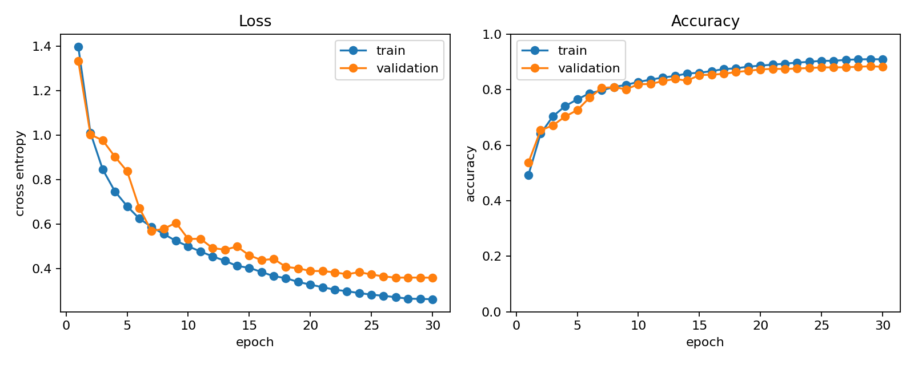
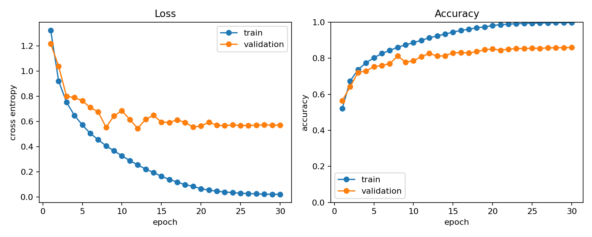

# Project 2：CIFAR-10 基础 CNN 训练工程

> 当前状态（2026-08-17）：工程、断点恢复测试、30 轮真实 CIFAR-10 GPU baseline
> 复现实验和只关闭数据增强的一变量对照均已完成。baseline 由 validation 选出的
> 第 29 轮 checkpoint 在官方 test 上达到 **87.04%**；无增强对照为 **84.36%**。

这个项目把 `project1_mnist` 的 `data / models / engine / train / utils / tests`
模块风格延续到 CIFAR-10，并修正了 MNIST 入门工程用 test 集选 checkpoint 的实验协议：

- 官方 CIFAR-10 train split 固定划为 **45,000 train + 5,000 validation**；
- 训练期间完全不构造官方 test split；
- `best.pt` 只由 validation accuracy 选择；
- `last.pt` 每个 epoch 覆盖保存，可恢复 model、optimizer、scheduler 与随机状态；
- 最终 test 只通过独立 `evaluate` 入口执行。

## 1. 数据协议

```text
CIFAR-10 official train (50,000)
├── train      45,000：由 --augmentation 配置随机增强，随后归一化
└── validation  5,000：仅归一化

CIFAR-10 official test (10,000)
└── 训练结束后由 evaluate.py 独立加载：仅归一化
```

划分由 `--seed` 控制，默认 `42`，train/validation 索引互斥且覆盖官方训练集。
使用两份指向同一官方训练数据的 dataset 对象，是为了让 train subset 使用随机增强，
validation subset 使用确定性预处理。归一化常量为 CIFAR-10 训练集常用的逐通道统计量：

```text
mean = (0.4914, 0.4822, 0.4465)
std  = (0.2470, 0.2435, 0.2616)
```

`--limit-train` 和 `--limit-val` 只用于调试；正式实验不要设置它们。

训练增强有三个可复现配置档位，validation/test 始终只做 `ToTensor + Normalize`：

| `--augmentation` | 训练预处理 | 用途 |
|---|---|---|
| `none` | 只归一化 | 无增强消融 |
| `basic`（默认） | RandomCrop + RandomHorizontalFlip | 本项目 baseline |
| `strong` | basic + CIFAR AutoAugment + RandomErasing | 更强增强实验 |

## 2. 模型与训练配置

`BasicCNN` 接收 `3×32×32` 输入，包含三组逐步扩通道的卷积特征提取、
BatchNorm、ReLU、两次最大池化和全局平均池化，最后使用 dropout 与线性分类头输出
10 类 logits。模型共有 **288,746 个可训练参数**。

默认训练配置：

| 项目 | 默认值 |
|---|---:|
| Optimizer | AdamW |
| Learning rate | `1e-3` |
| Weight decay | `5e-4` |
| Scheduler | cosine annealing |
| Epochs | 30 |
| Batch size | 128 |
| Loss | cross entropy |
| Validation size | 5,000 |
| Seed | 42 |
| Device | `auto`（CUDA 可用时使用 CUDA） |
| Augmentation | `basic` |

每轮 CSV 记录 `train_loss`、`train_accuracy`、`val_loss`、`val_accuracy`、
`learning_rate` 和 `epoch_seconds`。训练结束自动生成 `curves.png`。

## 3. 环境与测试

在仓库根目录 `A-thousand-journey-s-beginning` 执行。推荐使用已经配置好的
`ai-learn` Conda 环境。

安装依赖（环境尚未配置时）：

```powershell
conda activate ai-learn
python -m pip install -r project2_cifar10/requirements.txt
```

运行无需联网、不会下载 CIFAR-10 的 smoke tests：

```powershell
conda run --no-capture-output -n ai-learn python -m unittest discover `
  -s project2_cifar10/tests -v
```

这组测试覆盖：

1. CNN 输入/输出 shape；
2. train/validation 划分可复现、无交集且无遗漏；
3. `none/basic/strong` 三档增强内容正确，随机增强只出现在训练预处理；
4. mock 官方数据的 CIFAR-10 分支无需联网即可完成划分、预处理和 loader 构造；
5. synthetic 数据上的前向、反向、参数更新与 validation；
6. 完整训练 CLI 生成 CSV、曲线、best/last checkpoint，随后从 last 恢复并把历史从
   `[1, 2]` 连续写到 `[1, 2, 3]`，再独立加载 best 做 test。

## 4. 离线端到端 smoke run

synthetic 数据只是带人工图案的本地张量，用来验证工程管道，不代表 CIFAR-10 难度或
泛化性能。

```powershell
conda run --no-capture-output -n ai-learn python -m project2_cifar10.train `
  --dataset synthetic `
  --epochs 2 `
  --batch-size 32 `
  --limit-train 128 `
  --limit-val 64 `
  --device cpu `
  --output-dir runs/cifar10_smoke
```

独立加载 validation 选出的 best checkpoint，在 synthetic test 上走一遍评估入口：

```powershell
conda run --no-capture-output -n ai-learn python -m project2_cifar10.evaluate `
  runs/cifar10_smoke/cnn/best.pt `
  --dataset synthetic `
  --limit-test 64 `
  --device cpu
```

曲线在训练结束时已自动生成，也可以从 CSV 手动重绘：

```powershell
conda run --no-capture-output -n ai-learn python -m project2_cifar10.plot_history `
  runs/cifar10_smoke/cnn/history.csv `
  --output runs/cifar10_smoke/cnn/curves_manual.png
```

## 5. 正式 CIFAR-10 训练与最终评估

首次运行会由 torchvision 下载 CIFAR-10。下面是一条完整 baseline 命令：

```powershell
conda run --no-capture-output -n ai-learn python -m project2_cifar10.train `
  --dataset cifar10 `
  --epochs 30 `
  --batch-size 128 `
  --learning-rate 0.001 `
  --weight-decay 0.0005 `
  --validation-size 5000 `
  --num-workers 0 `
  --augmentation basic `
  --device auto `
  --seed 42 `
  --deterministic `
  --output-dir runs/cifar10_baseline_seed42
```

训练结束后才加载官方 test split，并且应优先评估 validation 选出的 `best.pt`：

```powershell
conda run --no-capture-output -n ai-learn python -m project2_cifar10.evaluate `
  runs/cifar10_baseline_seed42/cnn/best.pt `
  --batch-size 256 `
  --num-workers 0 `
  --device auto
```

若输出目录已有实验，程序默认拒绝覆盖。建议为新实验换 `--output-dir`；明确需要重跑同一
目录时才添加 `--overwrite`。

若训练被中断，`--epochs` 表示最终总轮数，用同一配置从 `last.pt` 恢复：

```powershell
conda run --no-capture-output -n ai-learn python -m project2_cifar10.train `
  --dataset cifar10 --epochs 30 --batch-size 128 `
  --learning-rate 0.001 --weight-decay 0.0005 `
  --augmentation basic --device auto --seed 42 --deterministic `
  --resume runs/cifar10_baseline_seed42/cnn/last.pt
```

恢复时会拒绝 model、dataset、augmentation、seed、scheduler、batch、optimizer、validation、
workers、limits 或 deterministic 与原实验不一致的配置，
并检查 CSV 最后一轮必须与 checkpoint 的 epoch 一致。checkpoint 保存了 Python、NumPy、
PyTorch CPU/CUDA RNG 和 DataLoader generator 状态。相同硬件与软件栈可最大限度复现续训；
不同 CPU/GPU、CUDA 或库版本仍不承诺逐 bit 相同。

## 6. checkpoint 与日志语义

```text
runs/cifar10/cnn/
├── config.json   # 解析后的命令行配置、实际 device、选模指标
├── history.csv   # 仅 train/validation 指标，不含 test 指标
├── curves.png    # 自动生成的 loss/accuracy 曲线
├── best.pt       # validation accuracy 首次严格提高时更新
└── last.pt       # 每个 epoch 更新，始终对应最后完成的 epoch
```

两个 checkpoint 均包含 model、optimizer、scheduler、epoch、历史最佳 validation
accuracy、配置、全局 RNG 和 DataLoader generator 状态。`selection_metric=validation_accuracy` 同时写入配置和 checkpoint；
独立评估入口会检查这个字段。若 validation accuracy 持平，保留最早达到该值的 best。

## 7. 2026-08-17 真实 baseline 与一变量对照

### 7.1 环境、数据下载处理与协议验证

验证环境：Windows、Python 3.11.15、PyTorch 2.11.0+cu130、torchvision
0.26.0+cu130、NumPy 2.4.4、Matplotlib 3.10.8，GPU 为 RTX 5060 Laptop。

已有 `data/cifar-10-python.tar.gz` 的大小为 170,498,071 bytes，实测 MD5 为
`c58f30108f718f92721af3b95e74349a`，与 torchvision 记录的官方归档 MD5 一致。旧的
`data/cifar-10-batches-py/` 因 ACL 异常无法读取或覆盖；未删除旧数据，而是把已通过 MD5
的原始归档复制到新根目录并重新解压：

```powershell
New-Item -ItemType Directory -Path data/cifar10_verified_20260817 -Force
Copy-Item data/cifar-10-python.tar.gz `
  data/cifar10_verified_20260817/cifar-10-python.tar.gz

conda run --no-capture-output -n ai-learn python -c `
  "from torchvision.datasets import CIFAR10; from project2_cifar10.data import build_transforms; train=CIFAR10(root='data/cifar10_verified_20260817', train=True, download=True, transform=build_transforms('basic')[1]); x,y=train[0]; print(len(train), tuple(x.shape), x.dtype, y)"
```

实际读取结果为 50,000 个 official train 样本、样本 shape `(3, 32, 32)`、dtype
`torch.float32`、10 类。seed 42 的划分再次验证为 45,000 train + 5,000 validation，
索引互斥且并集覆盖全部 50,000 个样本；此阶段只构造 `train=True` 数据集，未构造 test
loader。两次正式训练的首行也都明确输出 `test=not_loaded`。

### 7.2 实际执行命令

baseline 使用本 README 第 2、5 节的全部默认训练超参数，只把数据根目录指向上述已验证
副本，并使用新的输出目录避免覆盖旧实验：

```powershell
conda run --no-capture-output -n ai-learn python -m project2_cifar10.train `
  --dataset cifar10 `
  --data-dir data/cifar10_verified_20260817 `
  --epochs 30 `
  --batch-size 128 `
  --learning-rate 0.001 `
  --weight-decay 0.0005 `
  --validation-size 5000 `
  --num-workers 0 `
  --augmentation basic `
  --device auto `
  --seed 42 `
  --deterministic `
  --output-dir runs/cifar10_baseline_seed42_20260817 |
  Tee-Object runs/cifar10_baseline_seed42_20260817/train.log
```

baseline 训练完成并由 validation 锁定 best 后，才执行一次 official test 最终评估：

```powershell
conda run --no-capture-output -n ai-learn python -m project2_cifar10.evaluate `
  runs/cifar10_baseline_seed42_20260817/cnn/best.pt `
  --data-dir data/cifar10_verified_20260817 `
  --batch-size 256 `
  --num-workers 0 `
  --device auto |
  Tee-Object runs/cifar10_baseline_seed42_20260817/evaluate_best.log
```

小型对照预先固定为只关闭训练数据增强。除输出目录这个记账字段外，两个 `config.json`
逐字段对比确认唯一训练配置差异是 `augmentation: basic -> none`；模型、数据与划分、30 轮
预算、optimizer、scheduler、batch size、seed 和 deterministic 均不变：

```powershell
conda run --no-capture-output -n ai-learn python -m project2_cifar10.train `
  --dataset cifar10 `
  --data-dir data/cifar10_verified_20260817 `
  --epochs 30 `
  --batch-size 128 `
  --learning-rate 0.001 `
  --weight-decay 0.0005 `
  --validation-size 5000 `
  --num-workers 0 `
  --augmentation none `
  --device auto `
  --seed 42 `
  --deterministic `
  --output-dir runs/cifar10_ablation_no_augmentation_seed42_20260817 |
  Tee-Object runs/cifar10_ablation_no_augmentation_seed42_20260817/train.log

conda run --no-capture-output -n ai-learn python -m project2_cifar10.evaluate `
  runs/cifar10_ablation_no_augmentation_seed42_20260817/cnn/best.pt `
  --data-dir data/cifar10_verified_20260817 `
  --batch-size 256 `
  --num-workers 0 `
  --device auto |
  Tee-Object runs/cifar10_ablation_no_augmentation_seed42_20260817/evaluate_best.log
```

对照也只在 30 轮训练结束、validation 选出 best 后评估一次 official test；没有根据 test
追加实验、选择 epoch 或调整配置。

### 7.3 指标、checkpoint 与曲线

| 实验 | 训练增强 | validation 选中 epoch | 选中轮 train acc | best val loss | best val acc | train-val gap | 最终 test loss | 最终 test acc |
|---|---|---:|---:|---:|---:|---:|---:|---:|
| 默认 baseline | `basic` | 29 | 90.95% | 0.3610 | **88.42%** | 2.53 pp | **0.3982** | **87.04%** |
| 一变量对照 | `none` | 30 | 99.68% | 0.5710 | 85.92% | 13.76 pp | 0.6472 | 84.36% |
| 对照 - baseline | — | — | +8.73 pp | +0.2101 | -2.50 pp | +11.23 pp | +0.2490 | -2.68 pp |

baseline 的 30 轮训练时间合计 470.0 s，对照为 389.3 s；时间只用于记录，不作为模型质量
结论。baseline 的 epoch 30 validation 为 88.20%，低于 epoch 29，因此最终评估确实加载
epoch 29 `best.pt`，而非 epoch 30 `last.pt`。对照的 best 与 last 都对应 epoch 30。
四个 checkpoint 均能以 `weights_only=True` 读取，且包含
`selection_metric=validation_accuracy`：

```text
runs/cifar10_baseline_seed42_20260817/cnn/best.pt  # epoch 29, 3,517,941 bytes
runs/cifar10_baseline_seed42_20260817/cnn/last.pt  # epoch 30, 3,517,941 bytes
runs/cifar10_ablation_no_augmentation_seed42_20260817/cnn/best.pt  # epoch 30, 3,518,005 bytes
runs/cifar10_ablation_no_augmentation_seed42_20260817/cnn/last.pt  # epoch 30, 3,518,005 bytes
```

baseline 曲线：



无增强对照曲线：



可追溯小型副本：

- baseline：[`history.csv`](assets/cifar10_basiccnn_basic_seed42_20260817_history.csv) ·
  [`config.json`](assets/cifar10_basiccnn_basic_seed42_20260817_config.json) ·
  [`train output`](assets/cifar10_basiccnn_basic_seed42_20260817_train_output.txt) ·
  [`evaluate output`](assets/cifar10_basiccnn_basic_seed42_20260817_evaluate_output.txt)
- 无增强：[`history.csv`](assets/cifar10_basiccnn_none_seed42_20260817_history.csv) ·
  [`config.json`](assets/cifar10_basiccnn_none_seed42_20260817_config.json) ·
  [`train output`](assets/cifar10_basiccnn_none_seed42_20260817_train_output.txt) ·
  [`evaluate output`](assets/cifar10_basiccnn_none_seed42_20260817_evaluate_output.txt)

大体积 checkpoint 仍只保留在被 `.gitignore` 排除的 `runs/` 中。

### 7.4 对比解释与边界

关闭随机裁剪和水平翻转后，模型更容易记住固定训练图像：选中轮 train accuracy 从
90.95% 上升到 99.68%，但 best validation accuracy 下降 2.50 pp，train-validation gap
扩大 11.23 pp；曲线上也能看到 train loss 接近 0，而 validation loss 长期停在约
0.55--0.65。这个一变量结果支持“默认 basic augmentation 在本设置下抑制过拟合并改善
泛化”的解释，最终 test 的 -2.68 pp 与 validation 方向一致。

这仍然只是一组 seed、一个 BasicCNN 和一个数据划分的教学实验，没有均值/标准差，不能
写成对所有 CIFAR-10 模型都成立的普遍因果结论。baseline 的指标与 2026-08-16 同配置
run 精确一致，说明同一软硬件栈下的 deterministic 复现成功。torchvision 在 NumPy 2.4
下仍给出 `VisibleDeprecationWarning`；训练与指标正常，但不应表述为“无任何警告”。

### 7.5 现有测试

实际命令：

```powershell
conda run --no-capture-output -n ai-learn python -m unittest discover `
  -s project2_cifar10/tests -v
```

结果：实验开始前 **6/6 passed（21.793s）**；README 与产物更新后最终复跑仍为
**6/6 passed（17.114s）**，`compileall` 同时通过。测试覆盖模型 shape、可复现且互斥完备
的划分、三档增强内容、mock CIFAR-10 loader、synthetic 前反向与参数更新，以及
训练/恢复/validation 选模/独立 test 的完整 CLI。

## 8. 项目结构

```text
project2_cifar10/
├── data.py             # CIFAR-10 划分、三档增强、synthetic 离线数据
├── models.py           # BasicCNN
├── engine.py           # train_one_epoch / evaluate
├── utils.py            # seed/RNG、JSON/CSV、可恢复 checkpoint
├── train.py            # train/validation 训练入口与 --resume
├── evaluate.py         # 独立 test 评估入口
├── plot_history.py     # CSV 曲线绘制
├── requirements.txt
├── assets/              # 正式 baseline 的曲线、CSV 与 config 小型副本
└── tests/
    └── test_smoke.py   # 离线单元与端到端 smoke tests
```

## 9. 已知边界

- 当前只跑了一个 seed，不能据此估计方差；
- `--deterministic` 仍不保证跨硬件、CUDA 和库版本逐位一致；
- 这是 W3 基础 CNN，不包含 ResNet；残差网络与系统消融留给 W4；
- 87.04% 是基础 CNN 教学 baseline，不代表 SOTA；后续提升应只看 validation 做选择，
  避免根据 test 反复调参。
