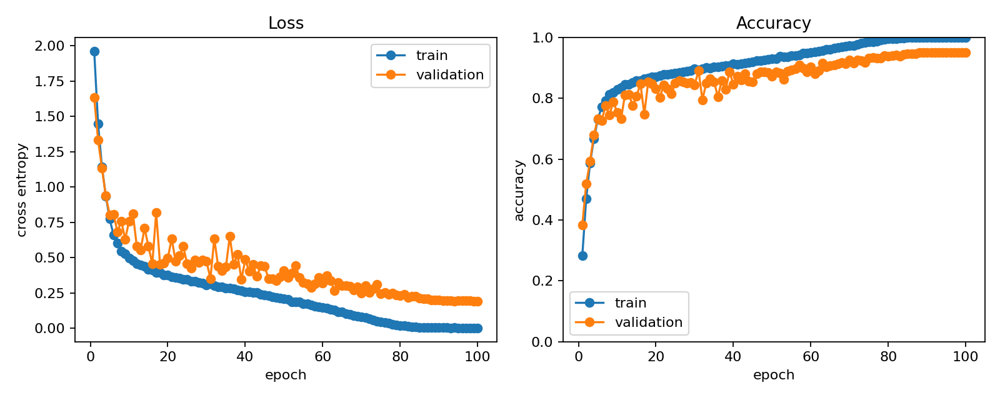
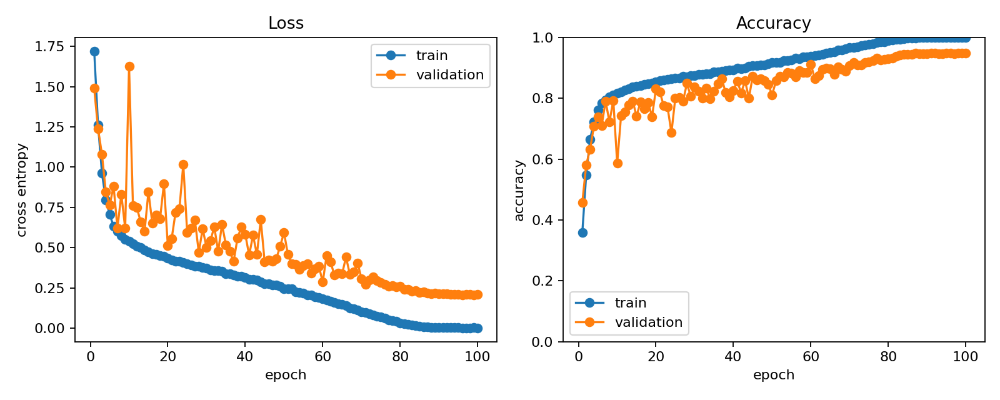

# Project 3：ResNet-CIFAR 复现与残差消融

> 状态（2026-08-16）：代码与 4 项离线测试、两组 100 轮正式实验均已完成。ResNet-18
> 的最佳 validation / 独立官方 test 为 **95.12% / 94.64%**，Plain-18 为
> **94.88% / 94.19%**。

本项目不调用 `torchvision.models.resnet18`，而是手写 CIFAR-10 版本的 BasicBlock、
projection shortcut 和四个 residual stage。它复用 W3 已验证的数据划分、增强、device、
CSV 和 checkpoint 协议，把本周注意力集中在 ResNet 论文的技术主张：深层网络学习
$F(x)+x$ 是否比直接学习 $H(x)$ 更容易。

## 1. 实验问题

主实验和最小消融只有一个变量不同：

| 命令模型 | 残差连接 | 卷积深度 | 其他配置 |
|---|---|---:|---|
| `resnet18` | 有 | 17 个卷积 + 1 个 Linear | baseline |
| `plain18` | 无 | 相同的两层 block/stage 布局 | 与 baseline 保持一致 |

`--no-batch-norm` 还提供 BN 消融，但不要在同一组实验中同时移除 residual 和 BN，否则
无法判断差异来自哪个变量。`--augmentation none/basic/strong` 同理由 W3 提供，正式残差
消融应固定为同一个增强档位。

## 2. CIFAR ResNet-18 结构

ImageNet ResNet-18 开头使用 `7x7, stride=2` 和 max-pool；CIFAR 图像只有 `32x32`，本项目
改成 `3x3, stride=1` 且不使用初始 max-pool，避免过早丢失空间信息：

```text
input           (B, 3, 32, 32)
stem 3x3        (B, 64, 32, 32)
stage1, 2 block (B, 64, 32, 32)
stage2, 2 block (B,128, 16, 16)
stage3, 2 block (B,256,  8,  8)
stage4, 2 block (B,512,  4,  4)
global avg pool (B,512,  1,  1)
linear          (B,10)
```

同 shape block 使用恒等 shortcut；通道翻倍和尺寸减半时使用 `1x1, stride=2` projection。
BasicBlock 的核心是：

$$
y=\operatorname{ReLU}(F(x;W)+S(x)),
$$

其中 $S(x)=x$ 或 projection。`plain18` 保留 $F$ 的两层卷积，只去掉 $S(x)$。

## 3. 默认训练配置

| 项目 | 值 |
|---|---:|
| Dataset split | 45,000 train / 5,000 validation / 10,000 final test |
| Optimizer | SGD, momentum 0.9 |
| Learning rate | 0.1 |
| Weight decay | 0.0005 |
| Scheduler | cosine annealing |
| Epochs | 100 |
| Batch size | 128 |
| Augmentation | basic crop + flip |
| Seed | 42 |
| Checkpoint selection | validation accuracy |

训练期间不加载官方 test。`best.pt` 只由 validation accuracy 选出，训练结束后再由
`evaluate.py` 对 test 评一次。

## 4. 环境和 smoke test

在仓库根目录执行：

```powershell
conda run --no-capture-output -n ai-learn python -m unittest discover `
  -s project3_resnet/tests -v
```

2026-08-16 实测 **4/4 passed**，覆盖：

1. residual/plain 两个模型的 `(B,3,32,32) -> (B,10)` 契约；
2. 主分支卷积置零时，正输入梯度可沿 identity shortcut 原样传播；
3. projection block 正确把 `(2,8,16,16)` 变为 `(2,16,8,8)`；
4. synthetic CLI 能训练、写 CSV/曲线/checkpoint，并由独立入口加载 best 做评估。

smoke 使用 `--base-channels 4` 只是为了 CPU 测试快速，不代表正式模型规模或指标。

## 5. 正式 baseline

```powershell
conda run --no-capture-output -n ai-learn python -m project3_resnet.train `
  --model resnet18 --dataset cifar10 `
  --epochs 100 --batch-size 128 `
  --learning-rate 0.1 --momentum 0.9 --weight-decay 0.0005 `
  --validation-size 5000 --augmentation basic --base-channels 64 `
  --device auto --seed 42 --deterministic `
  --output-dir runs/resnet18_baseline_seed42
```

独立 test：

```powershell
conda run --no-capture-output -n ai-learn python -m project3_resnet.evaluate `
  runs/resnet18_baseline_seed42/resnet18/best.pt `
  --dataset cifar10 --data-dir data --batch-size 256 --device auto
```

断点恢复使用同一组结构/数据参数，`--epochs` 仍表示最终总轮数：

```powershell
conda run --no-capture-output -n ai-learn python -m project3_resnet.train `
  --model resnet18 --dataset cifar10 --epochs 100 `
  --batch-size 128 --learning-rate 0.1 --momentum 0.9 --weight-decay 0.0005 `
  --augmentation basic --base-channels 64 --device auto --seed 42 --deterministic `
  --resume runs/resnet18_baseline_seed42/resnet18/last.pt
```

恢复会校验模型/数据/增强/BN、batch、SGD 超参数、validation、workers、limits 和确定性设置，
并恢复 momentum、scheduler、RNG 与 DataLoader generator；不允许用“续训”名义悄悄换配置。

## 6. 残差消融

完成 baseline 后运行唯一改动为 `--model plain18` 的实验：

```powershell
conda run --no-capture-output -n ai-learn python -m project3_resnet.train `
  --model plain18 --dataset cifar10 `
  --epochs 100 --batch-size 128 `
  --learning-rate 0.1 --momentum 0.9 --weight-decay 0.0005 `
  --validation-size 5000 --augmentation basic --base-channels 64 `
  --device auto --seed 42 --deterministic `
  --output-dir runs/plain18_ablation_seed42
```

比较时至少报告最佳 validation、对应 epoch、一次 test、训练时间和曲线。单 seed 差异只能
称为“本次运行观察”，不能声称统计显著。

| 实验 | 最佳 val acc | epoch | test acc | 参数量 | 说明 |
|---|---:|---:|---:|---:|---|
| ResNet-18 | 95.12% | 99 | 94.64% | 11,173,962 | baseline |
| Plain-18 | 94.88% | 100 | 94.19% | 11,000,138 | 只去 residual；无 projection shortcut |

### 2026-08-16 ResNet-18 实测

- 环境：Windows、Python 3.11.15、PyTorch 2.11.0+cu130、RTX 5060 Laptop GPU；
- 配置：45,000/5,000 固定 train/validation，basic augmentation，SGD momentum 0.9，
  lr 0.1，weight decay 0.0005，cosine 100 epochs，batch 128，seed 42，deterministic；
- 最佳 validation：95.12%（epoch 99）；epoch 100 validation：95.04%；
- 只评 validation 选出的 epoch 99：official test loss 0.1989，accuracy 94.64%（10,000）；
- train 在后期接近 100%，而 validation 约 95%，说明训练拟合与泛化不能混为一谈；
- torchvision/NumPy 2.4 出现已记录的 `VisibleDeprecationWarning`，训练与评估正常完成。



可追溯副本：[`history.csv`](assets/resnet18_seed42_history.csv) ·
[`config.json`](assets/resnet18_seed42_config.json)。checkpoint 体积较大，只保留在被忽略的
`runs/` 中。

### 2026-08-16 Plain-18 消融实测

- 与 baseline 使用相同 train/validation split、basic augmentation、SGD/cosine、batch、
  seed 和确定性设置，只把 `--model` 改为 `plain18`；
- 最佳也是最后一轮 validation：94.88%（epoch 100）；
- 只评 validation 选出的 epoch 100：official test loss 0.2402，accuracy 94.19%（10,000）；
- 100 轮累计训练时间约 61.2 分钟；ResNet-18 约 75.4 分钟，后者多出的 projection 分支
  带来计算与参数开销；
- ResNet-18 在本次单 seed 运行中仅高 **0.24 个 validation 百分点**、**0.45 个 test
  百分点**。这不足以宣称显著泛化优势；更清楚的区别是 Plain-18 在高学习率阶段波动更大，
  例如 epoch 9 到 10 validation 从 79.30% 降至 58.60%，之后随 cosine 降低才恢复；
- 两者后期 train accuracy 都接近 100%，因此都存在约 5 个百分点的 generalization gap。



可追溯副本：[`history.csv`](assets/plain18_seed42_history.csv) ·
[`config.json`](assets/plain18_seed42_config.json)。

## 7. 项目结构

```text
project3_resnet/
├── models.py       # BasicBlock、CIFAR ResNet-18、plain ablation
├── data.py         # 复用 W3 的无泄漏 CIFAR 数据协议
├── engine.py       # 复用 device-safe train/evaluate
├── utils.py        # 复用 CSV、RNG 与 checkpoint 状态
├── train.py        # SGD/cosine、validation 选模、resume
├── evaluate.py     # 独立 held-out test
├── plot_history.py
├── requirements.txt
├── assets/          # 正式实验曲线、CSV 与 config 小型副本
└── tests/test_smoke.py
```

## 8. 已知边界

- 这是 CIFAR 适配版 ResNet-18，不是对 ImageNet 论文表格的逐数值复现；
- 当前目标是复现残差机制和做受控消融，不追求 CIFAR-10 SOTA；
- 单 seed 不提供不确定性估计；严谨结论应至少重复 3 个 seed；
- `plain18` 在无 residual 时不需要 projection shortcut，因此参数量会略少；比较重点是
  优化行为和验证性能，不能说两者参数逐项完全相同；
- 两个模型都使用 seed 42，但 residual 模型额外构造 projection 层会改变后续随机数消费，
  所以“同 seed”不代表所有共有卷积层获得逐元素相同的初始权重。当前是一组现实的架构对照，
  不是把主分支初值锁死的配对实验。
