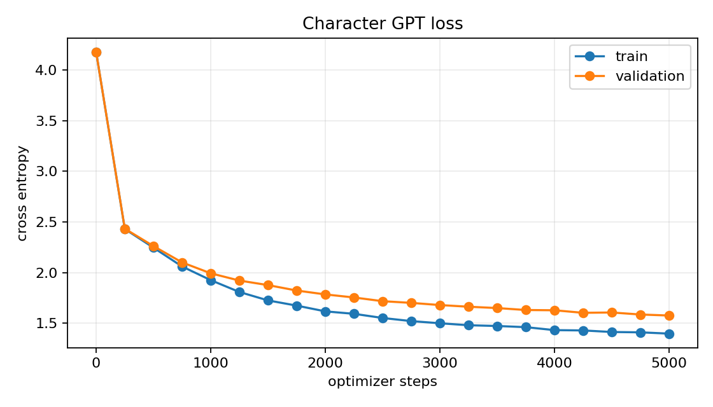

# Project 4：从零实现字符级 GPT

> 状态（2026-08-16）：模型、训练/恢复、生成入口与 4 项离线测试完成；Tiny Shakespeare
> 5000-step GPU baseline 已完成，最佳 validation loss 为 **1.5749**，并已独立生成样例。

这是一个教学规模的 decoder-only Transformer。项目只依赖 PyTorch，不复制
`karpathy/nanoGPT` 源码，也不调用 Hugging Face 模型：字符 tokenizer、Q/K/V、因果 mask、
multi-head attention、pre-LN residual block、交叉熵和 autoregressive generation 都在本项目
中显式实现。

## 1. 学习任务

给定字符序列 $x_1,\ldots,x_T$，模型在每个位置预测下一个字符：

$$
p(x_{t+1}\mid x_1,\ldots,x_t).
$$

训练样本不需要人工标签；同一段 token 向右平移一位就是 targets：

```text
inputs : F i r s t   C i t i z e
targets: i r s t     C i t i z e n
```

训练 loss 是所有 batch/position 的 next-token cross entropy。validation 使用语料最后 10%，
checkpoint 只按 validation loss 选择。

## 2. 模型数据流

默认配置：4 blocks、4 heads、embedding 128、context 128、dropout 0.1。

```text
token ids (B,T)
  ├─ token embedding    (B,T,C)
  └─ position embedding (T,C), broadcast to (B,T,C)
          ↓ add + dropout
  [LayerNorm → causal MHA → residual]
  [LayerNorm → 4C GELU MLP → residual] × 4
          ↓ final LayerNorm
  tied language-model head
          ↓
logits (B,T,vocab)
```

每个 head 的 scaled dot-product attention：

$$
\operatorname{Attention}(Q,K,V)
=\operatorname{softmax}\left(\frac{QK^\top}{\sqrt{d_h}}+M\right)V,
$$

其中 causal mask $M_{ij}=-\infty$ 当 $j>i$，所以位置 $i$ 不能看到未来 token。

## 3. 数据来源与可追溯性

语料来自 Karpathy `char-rnn` 仓库的 Tiny Shakespeare：

- 来源：<https://github.com/karpathy/char-rnn/tree/master/data/tinyshakespeare>
- 本地文件：`data/tinyshakespeare.txt`
- 实测字符数：1,115,394
- SHA-256：`86c4e6aa9db7c042ec79f339dcb96d42b0075e16b8fc2e86bf0ca57e2dc565ed`

重新准备：

```powershell
conda run --no-capture-output -n ai-learn python -m project4_nanogpt.prepare_data `
  --output data/tinyshakespeare.txt
```

脚本发现文件已存在时只读出长度/哈希，不默认覆盖。

## 4. 离线测试

```powershell
conda run --no-capture-output -n ai-learn python -m unittest discover `
  -s project4_nanogpt/tests -v
```

2026-08-16 实测 **4/4 passed**：

1. tokenizer encode/decode 可逆，batch 的 target 确实是 input 右移一位；
2. forward 输出 `(B,T,V)` 且交叉熵有限；
3. 修改位置 5 之后的 token 不改变位置 0–4 logits，直接验证 causal mask；
4. CPU 小语料训练到 step 4、从 `last.pt` 恢复到 step 6，CSV 为 `[0,2,4,6]`，并能独立生成。

## 5. 正式训练

```powershell
conda run --no-capture-output -n ai-learn python -m project4_nanogpt.train `
  --data data/tinyshakespeare.txt `
  --output-dir runs/nanogpt_tinyshakespeare_seed42 `
  --max-steps 5000 --eval-interval 250 --eval-iters 50 `
  --batch-size 64 --block-size 128 `
  --n-layer 4 --n-head 4 --n-embd 128 --dropout 0.1 `
  --learning-rate 0.0003 --weight-decay 0.1 `
  --device auto --seed 42 --deterministic
```

这里的 step 是 optimizer update 次数，不是遍历完整语料的 epoch。step 0 会先测未训练模型，
因此曲线能显示从随机初始化开始的 loss 下降。

断点恢复：

```powershell
conda run --no-capture-output -n ai-learn python -m project4_nanogpt.train `
  --data data/tinyshakespeare.txt `
  --output-dir runs/nanogpt_tinyshakespeare_seed42 `
  --max-steps 5000 --eval-interval 250 --eval-iters 50 `
  --batch-size 64 --block-size 128 `
  --n-layer 4 --n-head 4 --n-embd 128 --dropout 0.1 `
  --learning-rate 0.0003 --weight-decay 0.1 `
  --device auto --seed 42 --deterministic `
  --resume runs/nanogpt_tinyshakespeare_seed42/last.pt
```

恢复会验证 eval/log interval、batch、optimizer 参数、seed/deterministic、model config、字符表
和 corpus SHA-256，再恢复 model、optimizer 与 RNG。CSV 最后 step 必须和 checkpoint 匹配。

## 6. 生成

```powershell
conda activate ai-learn
python -m project4_nanogpt.generate `
  runs/nanogpt_tinyshakespeare_seed42/best.pt `
  --prompt "ROMEO:`n" --max-new-tokens 500 `
  --temperature 0.8 --top-k 40 --seed 42 `
  --output runs/nanogpt_tinyshakespeare_seed42/sample.txt
```

Windows 的 `conda run` 不支持把真实换行放进单个命令行参数，因此生成命令先激活环境再调用
`python`；训练命令没有换行参数，仍可直接使用 `conda run`。

- temperature 小于 1 会让分布更尖锐；过小容易重复，过大容易混乱；
- top-k 只保留概率最高的 $k$ 个候选，再重新归一化采样；
- 生成每一步只读取最后 `block_size` 个字符；本教学实现未加入 KV cache。

## 7. 产物

```text
runs/nanogpt_tinyshakespeare_seed42/
├── config.json   # 运行参数、模型结构、字符表、语料哈希
├── history.csv   # step/train_loss/val_loss/lr/time
├── curves.png
├── best.pt       # validation loss 最低
├── last.pt       # 最后完成评估的 step，可续训
└── sample.txt    # 独立生成示例
```

## 8. 项目结构

```text
project4_nanogpt/
├── data.py          # 字符 tokenizer、连续切分、随机 context batch
├── models.py        # attention、MLP、block、CharGPT、generate
├── train.py         # AdamW、验证选模、CSV、恢复
├── generate.py      # checkpoint → 独立生成
├── prepare_data.py  # 官方语料下载与哈希
├── plot_history.py
├── utils.py         # checkpoint/RNG/CSV/哈希
├── assets/          # 正式曲线、CSV、config 与生成样例的小型副本
└── tests/test_smoke.py
```

## 9. 结果表

| 数据 | 模型 | 参数量 | steps | 最佳 val loss | 最佳 step | 生成样例 |
|---|---|---:|---:|---:|---:|---|
| Tiny Shakespeare | 4L/4H/128D | 818,048 | 5000 | 1.5749 | 5000 | `assets/nanogpt_seed42_sample.txt` |

### 2026-08-16 正式 baseline

- 环境：RTX 5060 Laptop GPU、PyTorch 2.11.0+cu130；
- step 0：train loss 4.1789，validation loss 4.1783；
- step 5000：train loss 1.3960，validation loss **1.5749**，也是 validation-selected best；
- 训练用时约 270.7 秒；每次 validation 对 train/validation 各随机采样 50 个 batches；
- 固定生成配置得到角色名、换行、冒号和类似戏剧台词的局部结构，但仍有大量不存在的单词、
  语法错误和角色跳转。这说明小字符模型学到风格统计，不代表语言理解。

生成片段：

```text
ROMEO:
I consent that done good a moder and heart:
The unher for of York lap with content,
And preve must I within a city followern,
```



可追溯副本：[`history.csv`](assets/nanogpt_seed42_history.csv) ·
[`config.json`](assets/nanogpt_seed42_config.json) ·
[`sample.txt`](assets/nanogpt_seed42_sample.txt)。checkpoint 只保留在被忽略的 `runs/`。

## 10. 已知边界

- 字符 token 很直观但序列效率低，现代 LLM 通常使用 subword tokenizer；
- 训练语料只有约 1.1M 字符，模型学习的是局部 Shakespeare 风格，不是事实知识；
- 绝对位置 embedding 限制 context 不超过 128；
- 生成没有 KV cache，每一步重复计算整个 context；
- 一次 seed 的 validation loss 和一段样例都不足以证明泛化或语言理解。
