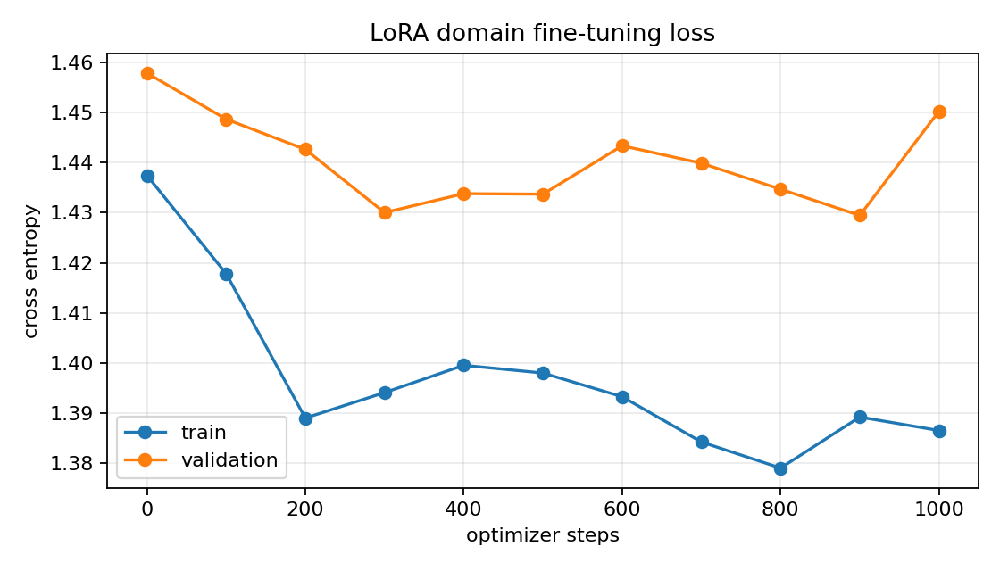
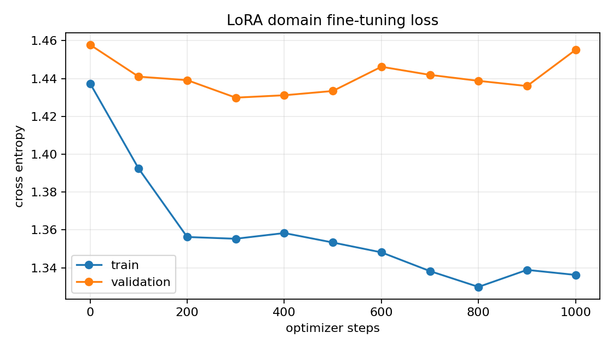

# Project 5：给字符级 GPT 注入 LoRA 的参数高效微调实验

> 状态（2026-08-16）：LoRA 注入/merge、领域语料、训练/生成入口和 5 项离线测试完成；
> rank 2 / rank 8 GPU 对照已完成，最佳 validation loss 分别为 **1.4294 / 1.4299**。

这个 W6 前沿小实验连接 W5 的“从零预训练”和参数高效微调（parameter-efficient
fine-tuning, PEFT）：冻结字符 GPT 的全部基座参数，只在 attention 线性层旁增加低秩矩阵，
观察用很少可训练参数适配 ROMEO/JULIET 台词子域时 validation loss 怎样变化。

它是教学规模的 LoRA 机制复现，不应包装成“大语言模型微调”或工业级结果。

## 1. LoRA 做了什么

普通线性层为：

$$
y=xW^\top+b.
$$

LoRA 冻结 $W$，只学习秩为 $r$ 的更新：

$$
\Delta W=\frac{\alpha}{r}BA,
$$

$$
y=xW^\top+b+\frac{\alpha}{r}xA^\top B^\top.
$$

若 $W\in\mathbb R^{d_{out}\times d_{in}}$，全量更新要训练
$d_{out}d_{in}$ 个权重；LoRA 只训练 $r(d_{in}+d_{out})$ 个。当
$r\ll\min(d_{in},d_{out})$ 时节省明显。

本项目随机初始化 $A$、将 $B$ 初始化为零，因此注入瞬间 $BA=0$，模型输出与 W5 checkpoint
完全一致。smoke test 直接用 `torch.equal` 验证了这个性质。

## 2. 注入位置

默认 `--target attention` 替换每个 GPT block 中：

- `attention.qkv`：一次产生 Q/K/V；
- `attention.projection`：拼接多头后的输出投影。

`--target all-linear` 还会替换 MLP 中的两层 Linear。token embedding、position embedding、
LayerNorm 和 tied language-model head 均保持冻结。

`LoRALinear` 内保留 frozen `base`，并增加 `lora_a`、`lora_b`。训练 checkpoint 保存完整状态
以便恢复，同时额外生成更小的 `adapter_best.pt`，其中只含 adapter 权重和必要元信息。

## 3. 领域语料

不是另找一个可能含未知字符的词表，而是从 W5 的同一份 Tiny Shakespeare 中抽取
`ROMEO:` 与 `JULIET:` block：

```powershell
conda run --no-capture-output -n ai-learn python -m project5_lora.prepare_domain `
  --source data/tinyshakespeare.txt `
  --output data/romeo_juliet_speeches.txt `
  --speakers ROMEO JULIET
```

2026-08-16 实测：

- 字符数：49,563；
- SHA-256：`f18cca53a1fa2a3eeae8ec6ec9e48cee8c5c2d67c0deaa2f747065e5aba4add8`；
- tokenizer 继续使用 W5 checkpoint 的字符表，任何未知字符都会明确报错。

这个子域来自预训练语料，因此实验问题是“强调角色风格”，不是学习全新知识；README 和
结论必须如实说明这一点。

## 4. 离线测试

```powershell
conda run --no-capture-output -n ai-learn python -m unittest discover `
  -s project5_lora/tests -v
```

2026-08-16 实测 **5/5 passed**：

1. $B=0$ 时注入前后 logits 逐元素相等，且只有 `lora_*` 参数可训练；
2. adapter 继承 base Linear 的 device 和 dtype，防止 CUDA 基座注入出 CPU 参数；
3. 随机设置 adapter 后，merge 前后 eval logits 在 $10^{-6}$ 容差内一致；
4. domain extractor 只保留指定 speaker block；
5. 临时 W5 checkpoint 分别跑 rank 2/rank 4 CPU 微调，两组 step 0 loss 完全相同，且
   CSV/best/last/adapter/curve → 独立生成全链路通过。

## 5. 正式实验：rank 2 与 rank 8

先完成 W5，下面都以同一个 validation-selected W5 `best.pt` 为基座。除 rank/alpha 外保持
其他变量一致，并令 $\alpha/r=2$：

### Rank 2

```powershell
conda run --no-capture-output -n ai-learn python -m project5_lora.train `
  --base-checkpoint runs/nanogpt_tinyshakespeare_seed42/best.pt `
  --data data/romeo_juliet_speeches.txt `
  --output-dir runs/lora_rank2_seed42 `
  --max-steps 1000 --eval-interval 100 --eval-iters 20 `
  --batch-size 32 --learning-rate 0.001 --weight-decay 0 `
  --rank 2 --alpha 4 --lora-dropout 0.05 --target attention `
  --device auto --seed 42 --deterministic
```

### Rank 8

```powershell
conda run --no-capture-output -n ai-learn python -m project5_lora.train `
  --base-checkpoint runs/nanogpt_tinyshakespeare_seed42/best.pt `
  --data data/romeo_juliet_speeches.txt `
  --output-dir runs/lora_rank8_seed42 `
  --max-steps 1000 --eval-interval 100 --eval-iters 20 `
  --batch-size 32 --learning-rate 0.001 --weight-decay 0 `
  --rank 8 --alpha 16 --lora-dropout 0.05 --target attention `
  --device auto --seed 42 --deterministic
```

step 0 在任何更新前测 domain loss，它就是两组共享的 frozen-base 参照。比较问题是：更高
rank 是否在相同 1000 steps 下取得更低 validation loss，以及为此增加了多少可训练参数。
不同 rank 初始化会消费不同数量的随机数，因此代码在 adapter 注入完成后把 RNG 重置到同一
seed；这样两组 step 0 会评估相同的随机 context，训练数据采样与 Dropout 也从同一随机流
开始。恢复训练时则以 checkpoint 保存的 RNG 状态为准。

## 6. 生成

```powershell
conda activate ai-learn
python -m project5_lora.generate `
  runs/lora_rank8_seed42/best.pt `
  --prompt "ROMEO:`n" --max-new-tokens 500 `
  --temperature 0.8 --top-k 40 --seed 42 `
  --output runs/lora_rank8_seed42/sample.txt
```

这里同样先激活环境，因为 Windows `conda run` 不能把真实换行作为单个 prompt 参数。

比较 W5 base 与两个 LoRA checkpoint 时必须使用相同 prompt、temperature、top-k 和 seed，
否则文本差异混合了采样随机性。

## 7. 结果表

| 实验 | rank | $\alpha$ | 可训练参数 | 比例 | step 0 val loss | 最佳 val loss | step |
|---|---:|---:|---:|---:|---:|---:|---:|
| LoRA-r2 | 2 | 4 | 6,144 | 0.75% | 1.4578 | **1.4294** | 900 |
| LoRA-r8 | 8 | 16 | 24,576 | 2.92% | 1.4578 | 1.4299 | 300 |

不能只看 train loss：领域语料很小，更高 rank 可能更快拟合训练 batch，却不一定降低 held-out
validation loss。一次 seed 的小差距只记为观察，不宣称 rank 的普遍规律。

### 2026-08-16 正式对照观察

- 两组 step 0 train/validation 完全相同（1.4374 / 1.4578），验证 zero-init 与 RNG 对齐；
- r2 最佳 validation 1.4294（step 900），r8 为 1.4299（step 300），差值只有 0.0005，
  远小于相邻评估波动，不能称为显著胜负；
- 到 step 1000，r8 train loss 1.3362，低于 r2 的 1.3866，但 validation 分别为
  1.4552 / 1.4502。更高 rank 更能拟合训练数据，却没有在本次 held-out 估计上获益；
- 两组约 33–34 秒完成。r8 可训练参数是 r2 的 4 倍，但仍仅占含 adapter 模型的 2.92%；
- 固定生成样例中 r8 更频繁产生 `ROMEO/JULIET` 标签，r2 也仍会跳到其他角色。单个随机样例
  只作定性补充，主结论仍来自 validation loss。

| 曲线与样例 | rank 2 | rank 8 |
|---|---|---|
| 曲线 |  |  |
| 原始 CSV | [`history.csv`](assets/lora_rank2_seed42_history.csv) | [`history.csv`](assets/lora_rank8_seed42_history.csv) |
| 配置 | [`config.json`](assets/lora_rank2_seed42_config.json) | [`config.json`](assets/lora_rank8_seed42_config.json) |
| 样例 | [`sample.txt`](assets/lora_rank2_seed42_sample.txt) | [`sample.txt`](assets/lora_rank8_seed42_sample.txt) |

## 8. 产物语义

```text
runs/lora_rank8_seed42/
├── config.json       # base/domain hash、LoRA 配置、参数量
├── history.csv
├── curves.png
├── best.pt           # 完整 frozen base + adapter，按 val loss 选择
├── last.pt           # 完整状态与 optimizer/RNG，可恢复
├── adapter_best.pt   # 只含 adapter 权重和可追溯元信息
└── sample.txt
```

`adapter_best.pt` 依赖完全相同的 W5 base checkpoint，文件中保存 base SHA-256 以防把 adapter
加载到错误基座。当前独立生成入口使用完整 `best.pt`，减少教学阶段的组装歧义。

## 9. 项目结构

```text
project5_lora/
├── lora.py           # LoRALinear、递归注入、merge、参数统计
├── prepare_domain.py # speaker block 抽取
├── train.py          # frozen-base 微调、验证选模、adapter 保存
├── generate.py
├── plot_history.py
├── assets/           # 两组正式曲线、CSV、config 与生成样例
└── tests/test_smoke.py
```

## 10. 已知边界

- 基座只有教学规模且在同一语料预训练，不能外推到真实大模型指令微调；
- 领域 corpus 是预训练语料子集，不是严格的 domain generalization；
- 当前只注入 Linear，未研究 embedding、LayerNorm 或 bias 微调；
- 只比较两个 rank、一个 seed、固定步数，不形成普适超参数结论；
- merge 会得到普通 Linear 便于推理，但训练应保留未 merge adapter 和 optimizer 状态。
